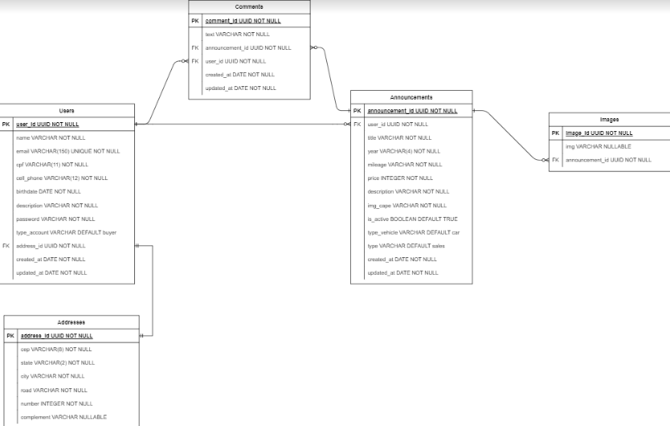

# motors-shop-backend

---

## Documentação do projeto

## Tabela de conteúdos

- [motors-shop-backend](#motors-shop-backend)
  - [Documentação do projeto](#documentação-do-projeto)
  - [Tabela de conteúdos](#tabela-de-conteúdos)
  - [1. Descrição do projeto](#1-descrição-do-projeto)
    - [1.1 Diagrama ER](#11-diagrama-er)
    - [1.2 URL base da aplicação](#12-url-base-da-aplicação)
  - [2. Tecnologias utilizadas](#2-tecnologias-utilizadas)
  - [3. Passos de instalação e execução](#3-passos-de-instalação-e-execução)
    - [3.1 Instalando dependências](#31-instalando-dependências)
    - [3.2 Crie um arquivo .env na raiz do projeto](#32-crie-um-arquivo-env-na-raiz-do-projeto)
    - [3.3 Rode as migrations](#33-rode-as-migrations)
    - [3.4 Inicie o servidor localmente](#34-inicie-o-servidor-localmente)
  - [4. Autenticação](#4-autenticação)
  - [5. Endpoints](#5-endpoints)
    - [Índice](#índice)
  - [1. **Users**](#1-users)
    - [Endpoints](#endpoints)
    - [1.1. **Criação de Usuário**](#11-criação-de-usuário)
    - [`/users`](#users)
    - [Exemplo de Request:](#exemplo-de-request)
    - [Corpo da Requisição:](#corpo-da-requisição)
    - [Exemplo de Response:](#exemplo-de-response)
    - [Possíveis Erros:](#possíveis-erros)
    - [1.2. **Login do Usuário**](#12-login-do-usuário)
    - [Exemplo de Request:](#exemplo-de-request-1)
    - [Corpo da Requisição:](#corpo-da-requisição-1)
    - [Exemplo de Response:](#exemplo-de-response-1)
    - [Possíveis Erros:](#possíveis-erros-1)
    - [1.3. **Listando Usuário**](#13-listando-usuário)
    - [`/users/:id`](#usersid)
    - [Exemplo de Request:](#exemplo-de-request-2)
    - [Corpo da Requisição:](#corpo-da-requisição-2)
    - [Exemplo de Response:](#exemplo-de-response-2)
    - [Possíveis Erros:](#possíveis-erros-2)
    - [1.4. **Atualização do Usuário**](#14-atualização-do-usuário)
    - [`/users/:id`](#usersid-1)
    - [Exemplo de Request:](#exemplo-de-request-3)
    - [Corpo da Requisição:](#corpo-da-requisição-3)
    - [Exemplo de Response:](#exemplo-de-response-3)
    - [Possíveis Erros:](#possíveis-erros-3)
    - [1.5 **Delete do usuário**](#15-delete-do-usuário)
    - [`/users/:id`](#usersid-2)
    - [Exemplo de Request:](#exemplo-de-request-4)
    - [Corpo da Requisição:](#corpo-da-requisição-4)
    - [Exemplo de Response:](#exemplo-de-response-4)
    - [Possíveis Erros:](#possíveis-erros-4)
  - [| 404 not found    | User not found.              |](#-404-not-found-----user-not-found--------------)
    - [1.6 **Envio de email**](#16-envio-de-email)
    - [`/users/forgot_password`](#usersforgot_password)
    - [Exemplo de Request:](#exemplo-de-request-5)
    - [Corpo da Requisição:](#corpo-da-requisição-5)
    - [Exemplo de Response:](#exemplo-de-response-5)
    - [Possíveis Erros:](#possíveis-erros-5)
    - [1.7. **Recuperação da senha**](#17-recuperação-da-senha)
    - [`/users/reset_password/:id`](#usersreset_passwordid)
    - [Exemplo de Request:](#exemplo-de-request-6)
    - [Corpo da Requisição:](#corpo-da-requisição-6)
    - [Exemplo de Response:](#exemplo-de-response-6)
    - [Possíveis Erros:](#possíveis-erros-6)
  - [2. **Announcements**](#2-announcements)
    - [Endpoints](#endpoints-1)
    - [2.1. **Criação de um anúncio**](#21-criação-de-um-anúncio)
    - [`/announcements`](#announcements)
    - [Exemplo de Request:](#exemplo-de-request-7)
    - [Corpo da Requisição:](#corpo-da-requisição-7)
    - [Exemplo de Response:](#exemplo-de-response-7)
    - [Possíveis Erros:](#possíveis-erros-7)
    - [2.2. **Listar todos os anúncios**](#22-listar-todos-os-anúncios)
    - [`/announcements`](#announcements-1)
    - [Exemplo de Request:](#exemplo-de-request-8)
    - [Corpo da Requisição:](#corpo-da-requisição-8)
    - [Exemplo de Response:](#exemplo-de-response-8)
    - [Possíveis Erros:](#possíveis-erros-8)
    - [2.3. **Atualizar dados do anúncio**](#23-atualizar-dados-do-anúncio)
    - [`/announcements/:id`](#announcementsid)
    - [Exemplo de Request:](#exemplo-de-request-9)
    - [Corpo da Requisição:](#corpo-da-requisição-9)
    - [Exemplo de Response:](#exemplo-de-response-9)
    - [Possíveis Erros:](#possíveis-erros-9)
    - [2.4. **Delete do anúncio**](#24-delete-do-anúncio)
    - [`/announcements/:id`](#announcementsid-1)
    - [Exemplo de Request:](#exemplo-de-request-10)
    - [Corpo da Requisição:](#corpo-da-requisição-10)
    - [Exemplo de Response:](#exemplo-de-response-10)
    - [Possíveis Erros:](#possíveis-erros-10)
    - [2.5. **Listando um anúncio**](#25-listando-um-anúncio)
    - [`/announcements/:id`](#announcementsid-2)
    - [Exemplo de Request:](#exemplo-de-request-11)
    - [Corpo da Requisição:](#corpo-da-requisição-11)
    - [Exemplo de Response:](#exemplo-de-response-11)
    - [Possíveis Erros:](#possíveis-erros-11)
  - [3. **Comments**](#3-comments)
    - [Endpoints](#endpoints-2)
    - [3.1. **Criação de um comentário em um anúncio**](#31-criação-de-um-comentário-em-um-anúncio)
    - [`/comments/:id`](#commentsid)
    - [Exemplo de Request:](#exemplo-de-request-12)
    - [Corpo da Requisição:](#corpo-da-requisição-12)
    - [Exemplo de Response:](#exemplo-de-response-12)
    - [Possíveis Erros:](#possíveis-erros-12)
    - [3.2. **Atualizar dados do comentário**](#32-atualizar-dados-do-comentário)
    - [`/comments/:id`](#commentsid-1)
    - [Exemplo de Request:](#exemplo-de-request-13)
    - [Corpo da Requisição:](#corpo-da-requisição-13)
    - [Exemplo de Response:](#exemplo-de-response-13)
    - [Possíveis Erros:](#possíveis-erros-13)
    - [3.3. **Delete do comentário**](#33-delete-do-comentário)
    - [`/comments/:id`](#commentsid-2)
    - [Exemplo de Request:](#exemplo-de-request-14)
    - [Corpo da Requisição:](#corpo-da-requisição-14)
    - [Exemplo de Response:](#exemplo-de-response-14)
    - [Possíveis Erros:](#possíveis-erros-14)
  - [4. **Images**](#4-images)
  - [5. **Address**](#5-address)
    - [Endpoints](#endpoints-3)
    - [5.1. **Atualização de um endereço de usuário**](#51-atualização-de-um-endereço-de-usuário)
    - [`/users/address/:id`](#usersaddressid)
    - [Exemplo de Request:](#exemplo-de-request-15)
    - [Corpo da Requisição:](#corpo-da-requisição-15)
    - [Exemplo de Response:](#exemplo-de-response-15)
    - [Possíveis Erros:](#possíveis-erros-15)

---

## 1. Descrição do projeto

[ Voltar para o topo ](#tabela-de-conteúdos)

(Projeto em desenvolvimento) O projeto possui um crud de usuário, que podem criar conta de comprador ou anunciante, onde anunciantes podem conter muitos anúncios associados.

### 1.1 Diagrama ER

Diagrama ER da API definindo bem as relações entre as tabelas do banco de dados.



### 1.2 URL base da aplicação

http://localhost:3333

---

## 2. Tecnologias utilizadas

[ Voltar para o topo ](#tabela-de-conteúdos)

- TypeScript
- NodeJs
- Express
- TypeORM
- PostgreSQL
- yup
- cors

---

## 3. Passos de instalação e execução

Certifique que você já criou uma database postgreSQL para o projeto

### 3.1 Instalando dependências

Clone o projeto em sua máquina e instale as dependências no projeto:

```
yarn
```

### 3.2 Crie um arquivo .env na raiz do projeto

Copie o formato do arquivo .env.example para o arquivo .env e preencha as variáveis, exemplo:

```
SECRET_KEY="sua_chave_secreta"
```

Preencha todas as variáveis

### 3.3 Rode as migrations

Crie as tabelas no banco de dados com o comando:

```
yarn typeorm migration:run -d src/data-source.ts
```

### 3.4 Inicie o servidor localmente

```
yarn dev
```

**Após iniciar o servidor localmente você pode testar algumas rotas no frontend da aplicação que está logo abaixo:**

[https://github.com/m6-projeto-final-grupo36/motors-shop-frontend](https://github.com/m6-projeto-final-grupo36/motors-shop-frontend)

---

## 4. Autenticação

[ Voltar para o topo ](#tabela-de-conteúdos)

```
Authorization: Bearer token
```

---

## 5. Endpoints

[ Voltar para o topo ](#tabela-de-conteúdos)

### Índice

- [Users](#1-users)
  - [POST - /users](#11-criação-de-usuário)
  - [POST - /login](#12-login-do-usuário)
  - [GET - /users/:id](#13-listando-usuário)
  - [PATCH - /users/:id](#14-atualização-do-usuário)
  - [DELETE - /users/:id](#15-delete-do-usuário)
  - [POST - /users/forgot_password](#16-envio-de-email)
  - [PATCH - /users/reset_password/:id](#17-recuperação-da-senha)
- [Announcements](#2-announcement)
  - [POST - /announcements](#21-criação-de-um-anúncio)
  - [GET - /announcements](#22-listar-todos-os-anúncios)
  - [PATCH - /announcements/:id](#23-atualizar-dados-do-anúncio)
  - [DELETE - /announcements/:id](#24-delete-do-anúncio)
  - [GET - /announcements/:id](#25-listando-um-anúncio)
- [Comments](#3-comments)
  - [POST - /comments/:id](#31-criação-de-um-comentário-em-um-anúncio)
  - [PATCH -/comments/:id](#32-atualizar-dados-do-comentário)
  - [DELETE - /comments/:id](#33-delete-do-comentário)
- [Images](#4-images)
- [Address](#5-address)
  - [PATCH - /users/address/:id](#51-atualização-de-um-endereço-de-usuário)

## 1. **Users**

[ Voltar para os Endpoints ](#5-endpoints)

O objeto User é definido como:

| Campo        | Tipo    | Descrição                                           |
| ------------ | ------- | --------------------------------------------------- |
| id           | string  | Identificador único do usuário.                     |
| name         | string  | O nome do usuário.                                  |
| cell_phone   | string  | O número do telefone do usuário.                    |
| email        | string  | O e-mail do usuário.                                |
| password     | string  | A senha de acesso do usuário.                       |
| cpf          | string  | O CPF do usuário.                                   |
| description  | string  | A descrição do usuário                              |
| birthdate    | date    | Data de aniversário do usuário.                     |
| type_account | string  | Tipo de conta (buyer | advertiser) (default buyer). |
| address      | Adrress | Endereço do usuário.                                |
| created_at   | date    | Data de cadastro do usuário.                        |
| updated_at   | date    | Data de atualização do perfil do usuário.           |

### Endpoints

| Método | Rota                      | Descrição                  |
| ------ | ------------------------- | -------------------------- |
| POST   | /users                    | Criação de um usuário.     |
| POST   | /login                    | Login do usuário.          |
| GET    | /users/:id                | Lista o usuário.           |
| PATCH  | /users/:id                | Atualiza dados do usuário. |
| DELETE | /users/:id                | Delete o usuário.          |
| POST   | /users/forgot_password/   | Envio de email.            |
| PATCH  | /users/reset_password/:id | Recuperar a senha          |

---

### 1.1. **Criação de Usuário**

[ Voltar para os Endpoints ](#5-endpoints)

### `/users`

### Exemplo de Request:

```
POST /users
Host: http://localhost:3333
Authorization: None
Content-type: application/json
```

### Corpo da Requisição:

```json
{
	"name": "Jorge Kimura",
	"email": "jorge@mail.br",
	"cpf": "12345678918",
	"cell_phone": "41981214212",
	"birthdate": "Tue Feb 01 2005 00:00:00 GMT-0200 (Horário de Verão de Brasília)",
	"description": "Ollalaalaalallfdodkri",
	"password": "1234567",
	"address": {
		"number": "1005",
		"city": "Piedader",
		"state": "PR",
		"cep": "80521518",
		"road": "Rua das Flores",
		"complement": "casa"
	}
}
```

### Exemplo de Response:

```
201 Created
```

```json
{
	"name": "Jorge Kimura",
	"email": "jorge@mail.br",
	"cpf": "12345678918",
	"cell_phone": "41981214212",
	"birthdate": "2005-02-01T02:00:00.000Z",
	"description": "Ollalaalaalallfdodkri",
	"type_account": "buyer",
	"address": {
		"id": "3fee51da-4f48-4c68-aab0-62167bdce3ac",
		"cep": "80521518",
		"state": "PR",
		"city": "Piedader",
		"road": "Rua das Flores",
		"number": 1005,
		"complement": "casa"
	},
	"id": "d5e7976f-4f6e-430f-9023-204347b12e9e",
	"created_at": "2023-03-06",
	"updated_at": "2023-03-06"
}
```

### Possíveis Erros:

| Código do Erro  | Descrição             |
| --------------- | --------------------- |
| 400 Bad request | Email already exists. |

---

### 1.2. **Login do Usuário**

[ Voltar aos Endpoints ](#5-endpoints)

### Exemplo de Request:

```
POST /login
Host: http://localhost:3333
Authorization: None
Content-type: application/json
```

### Corpo da Requisição:

```json
{
	"email": "makson@mail.br",
	"password": "1234567"
}
```

### Exemplo de Response:

```
200 OK
```

```json
{
	"token": "token unico",
	"user": {
		"id": "12e83142-fa57-4c4b-9bea-cb7fb89732b1",
		"name": "Makson Sillas",
		"email": "makson@mail.br",
		"cpf": "12345678910",
		"cell_phone": "41981214212",
		"birthdate": "2001-04-07",
		"description": "Ollalaalaalallfdodkri",
		"type_account": "advertiser",
		"created_at": "2023-03-06",
		"updated_at": "2023-03-06",
		"address": {
			"id": "df663fc6-331c-4379-bdb3-81a6e16da402",
			"cep": "80521518",
			"state": "PR",
			"city": "Piedader",
			"road": "Rua das Flores",
			"number": 1004,
			"complement": "casa"
		}
	}
}
```

### Possíveis Erros:

| Código do Erro  | Descrição                   |
| --------------- | --------------------------- |
| 400 Bad request | email/password is required. |
| 403 forbidden   | Wrong email/password.       |

---

### 1.3. **Listando Usuário**

[ Voltar aos Endpoints ](#5-endpoints)

### `/users/:id`

### Exemplo de Request:

```

GET /users
Host: http://localhost:3333
Authorization: None
Content-type: application/json

```

### Corpo da Requisição:

```json
Vazio
```

### Exemplo de Response:

```
200 OK
```

```json
{
	"id": "b891ec98-3b03-4f31-9645-57b04a5356d5",
	"name": "Jorge Kimura",
	"email": "jorge@mail.br",
	"cpf": "12312312314",
	"cell_phone": "11912345678",
	"birthdate": "2023-03-02",
	"description": "Olaaaa",
	"type_account": "advertiser",
	"created_at": "2023-03-02",
	"updated_at": "2023-03-06",
	"announcements": []
}
```

### Possíveis Erros:

| Código do Erro  | Descrição                   |
| --------------- | --------------------------- |
| 404 Not found   | User not found.             |


---

### 1.4. **Atualização do Usuário**

[ Voltar aos Endpoints ](#5-endpoints)

### `/users/:id`

```
Pode ser atualizado o name, cell_phone, email, password, cpf, birthdate e description todos de uma vez ou parcialmente.
```

### Exemplo de Request:

```
PATCH /users/:id
Host: http://localhost:3333
Authorization: Bearer token
Content-type: application/json

```

### Corpo da Requisição:

```json
{
	"name": "Jorge Kimura"
}
```

### Exemplo de Response:

```
200 OK
```

```json
{
	"id": "b891ec98-3b03-4f31-9645-57b04a5356d5",
	"name": "Jorge Kimura",
	"email": "jorge@mail.br",
	"cpf": "12312312314",
	"cell_phone": "11912345678",
	"birthdate": "2023-03-02",
	"description": "Olaaaa",
	"type_account": "advertiser",
	"created_at": "2023-03-02",
	"updated_at": "2023-03-06"
}
```

### Possíveis Erros:

| Código do Erro   | Descrição                    |
| ---------------- | ---------------------------- |
| 401 Unauthorized | Invalid token.               |
| 401 Unauthorized | You don't have permission.   |
| 403 Forbidden    | Email already being used.    |
| 403 Forbidden    | CPF already being used.      |
| 404 not found    | User not found.              |

---

### 1.5 **Delete do usuário**

[ Voltar aos Endpoints ](#5-endpoints)

### `/users/:id`

### Exemplo de Request:

```

DELETE /users/:id
Host: http://localhost:3333
Authorization: Bearer token
Content-type: application/json

```

### Corpo da Requisição:

```json
Vazio
```

### Exemplo de Response:

```
204 OK
```

```json
Vazio
```

### Possíveis Erros:

| Código do Erro   | Descrição                    |
| ---------------- | ---------------------------- |
| 401 Unauthorized | Invalid token.               |
| 401 Unauthorized | You don't have permission.   |
| 404 not found    | User not found.              |
---

### 1.6 **Envio de email**

[ Voltar aos Endpoints ](#5-endpoints)

### `/users/forgot_password`

### Exemplo de Request:

```

POST /users/forgot_password
Host: http://localhost:3333
Authorization: None
Content-type: application/json

```

### Corpo da Requisição:

```json
{
	"name": "Joao da Silva",
	"email": "testeemail051@gmail.com"
}
```

### Exemplo de Response:

```
200 OK
```

```json
{
	"message": "A password recovery email was successfully sent."
}
```

### Possíveis Erros:

| Código do Erro   | Descrição                    |
| ---------------- | ---------------------------- |
| 400 Bad Request  | Missing data body.           |

---

### 1.7. **Recuperação da senha**

[ Voltar aos Endpoints ](#5-endpoints)

### `/users/reset_password/:id`

### Exemplo de Request:

```

PATCH /users/reset_password/:id
Host: http://localhost:3333
Authorization: None
Content-type: application/json

```

### Corpo da Requisição:

```json
{
	"password": "1234"
}
```

### Exemplo de Response:

```
200 OK
```

```json
{
	"message": "Password updated successfully."
}
```

### Possíveis Erros:

| Código do Erro   | Descrição                    |
| ---------------- | ---------------------------- |
| 400 Bad Request  | Missing data body.           |
| 404 Not found    | User not found               |

---

## 2. **Announcements**

[ Voltar para os Endpoints ](#5-endpoints)

O objeto Announcements é definido como:

| Campo        | Tipo    | Descrição                                                              |
| ------------ | ------- | ---------------------------------------------------------------------- |
| id           | string  | Identificador único do anúncio                                         |
| title        | string  | Título do anúncio                                                      |
| year         | string  | Ano do veículo (4 dígitos)                                             |
| mileage      | string  | Kms rodados                                                            |
| price        | number  | Preço em centavos                                                      |
| description  | string  | Descrição do anúncio                                                   |
| img_cape     | string  | Imagem da capa do anúncio                                              |
| is_active    | boolean | Indica se o anúncio está ativo (default true)                          |
| type_vehicle | string  | Carro ou moto (car, motorcycle) (default car)                          |
| type         | string  | Venda ou leilão (sales, auction) (default sales)                       |
| images       | string  | Imagens do veículo anunciado (Campo não origatório) (máximo 6 imagens) |
| created_at   | date    | Data de cadastro do anúncio                                            |
| updated_at   | date    | Data de atualização do anúncio                                         |

### Endpoints

| Método | Rota               | Descrição               |
| ------ | ------------------ | ----------------------- |
| POST   | /announcements     | Criação de um anúncio   |
| GET    | /announcements     | Lista todos os anúncios |
| GET    | /announcements/:id | Lista um anúncio        |
| PATCH  | /announcements/:id | Atualiza um anúncio     |
| DELETE | /announcements/:id | Deleta o anúncio        |

---

### 2.1. **Criação de um anúncio**

[ Voltar para os Endpoints ](#5-endpoints)

### `/announcements`

### Exemplo de Request:

```
POST /announcements
Host: http://localhost:3333
Authorization: Bearer token
Content-type: application/json
```

Os campos obrigatórios são:

- title
- year
- mileage
- price
- description
- img_cape

### Corpo da Requisição:

```json
{
  "title": "Um carro novo",
  "year": 2021,
  "mileage": 12345,
  "price": 1265438972,
  "description": "O carro está perfeito",
  "img_cape": "link_da_imagem",
  "images": ["link_1", "link_2"],
  "is_active": false,
  "type": "sales",
  "type_vehicle": "car"
}
```

### Exemplo de Response:

```
201 Created
```

```json
{
  "title": "Um carro novo",
  "year": "2021",
  "mileage": "12345",
  "price": 1265438972,
  "description": "O carro está perfeito",
  "img_cape": "link_da_imagem",
  "type_vehicle": "car",
  "type": "sales",
  "is_active": false,
  "id": "2cf7e3ba-cb72-4b02-a699-6bb0e62ea0ea",
  "created_at": "2023-02-24T00:40:08.954Z",
  "updated_at": "2023-02-24T00:40:08.954Z",
  "images": ["link_1", "link_2"]
}
```

### Possíveis Erros:

| Código do Erro  | Descrição                    |
| --------------- | ---------------------------- |
| 400 Bad request | Maximum 6 images.            |
| 401 forbidden   | Invalid token.               |

---

### 2.2. **Listar todos os anúncios**

[ Voltar para os Endpoints ](#5-endpoints)

### `/announcements`

### Exemplo de Request:

```
GET /announcements
Host: http://localhost:3333
Authorization: None
Content-type: application/json
```

### Corpo da Requisição:

```json
Vazio
```

### Exemplo de Response:

```
200 Ok
```

```json
[
  {
		"id": "ab864955-487f-405f-8bff-b7a7376ea159",
		"title": "Moto Elite 125",
		"year": "2021",
		"mileage": "0",
		"price": 1479000,
		"description": "O carro está perfeito",
		"img_cape": "link da imagem",
		"is_active": true,
		"type_vehicle": "car",
		"type": "sales",
		"created_at": "2023-03-06",
		"updated_at": "2023-03-06",
		"user": {
			"id": "b891ec98-3b03-4f31-9645-57b04a5356d5",
			"name": "Jorge Kimura",
			"email": "testeemail51@gmail.com",
			"cpf": "12312312310",
			"cell_phone": "11912345678",
			"birthdate": "2023-03-02",
			"description": "Olaaaa",
			"type_account": "advertiser",
			"created_at": "2023-03-02",
			"updated_at": "2023-03-06"
		}
	}
]
```

### Possíveis Erros:

Nenhum, o máximo que pode acontecer é retornar uma lista vazia.

---

### 2.3. **Atualizar dados do anúncio**

[ Voltar para os Endpoints ](#5-endpoints)

### `/announcements/:id`

```
Pode ser atualizado todos os campos, podem ser atualizados de uma vez ou parcialmente.
```

### Exemplo de Request:

```
PATCH /announcements/:id
Host: http://localhost:3333
Authorization: Bearer token
Content-type: application/json
```

### Corpo da Requisição:

```json
{
  "title": "Um carro em ótimo estado",
  "images": ["link_1", "link_2", "link3", "link4", "link5", "link6"]
}
```

### Exemplo de Response:

```
200 Ok
```

```json
{
  "id": "2cf7e3ba-cb72-4b02-a699-6bb0e62ea0ea",
  "title": "Um carro em ótimo estado",
  "year": "2000",
  "mileage": "12345",
  "price": 1265438972,
  "description": "O carro está perfeito",
  "img_cape": "link_da_imagem",
  "is_active": false,
  "type_vehicle": "car",
  "type": "sales",
  "created_at": "2023-02-24T00:40:08.954Z",
  "updated_at": "2023-02-24T00:48:54.534Z",
  "images": ["link_1", "link_2", "link3", "link4", "link5", "link6"]
}
```

### Possíveis Erros:

| Código do Erro  | Descrição                    |
| --------------- | ---------------------------- |
| 400 Bad request | Missing authorization token. |
| 400 Bad request | Maximum 6 images.            |
| 403 forbidden   | Invalid token.               |
| 404 not found   | Invalid UUID                 |
| 404 not found   | Announcement not found.      |

---

### 2.4. **Delete do anúncio**

[ Voltar aos Endpoints ](#5-endpoints)

### `/announcements/:id`

### Exemplo de Request:

```

DELETE /announcements/:id
Host: http://localhost:3333
Authorization: Bearer token
Content-type: application/json

```

### Corpo da Requisição:

```json
Vazio
```

### Exemplo de Response:

```
204 OK
```

```json
Vazio
```

### Possíveis Erros:

| Código do Erro  | Descrição                    |
| --------------- | ---------------------------- |
| 400 Bad request | Missing authorization token. |
| 400 Bad request | Invalid UUID                 |
| 403 forbidden   | Invalid token.               |
| 404 not found   | Announcement not found.      |

---

### 2.5. **Listando um anúncio**

[ Voltar aos Endpoints ](#5-endpoints)

### `/announcements/:id`

### Exemplo de Request:

```

GET /announcements/:id
Host: http://localhost:3333
Authorization: None
Content-type: application/json

```

### Corpo da Requisição:

```json
Vazio
```

### Exemplo de Response:

```
200 OK
```

```json
{
	"id": "4eee05a3-e56d-40d6-92b3-100f761d8287",
	"title": "Gol",
	"year": "2022",
	"mileage": "10",
	"price": 15000,
	"description": "Carro le-gal.",
	"img_cape": "link de imagem",
	"is_active": true,
	"type_vehicle": "car",
	"type": "sales",
	"created_at": "2023-03-03",
	"updated_at": "2023-03-03",
	"images": [],
	"user": {
		"id": "15f86d97-d8f4-4496-ab2b-f4d2fda910df",
		"name": "Jorge Kimura",
		"email": "kimurajorge2001@gmail.com",
		"cpf": "12345678912",
		"cell_phone": "11912345678",
		"birthdate": "2001-04-27",
		"description": "Olalaaaaa",
		"type_account": "advertiser",
		"created_at": "2023-03-02",
		"updated_at": "2023-03-02"
	},
	"comments": [
		{
			"id": "a11deee5-dc20-47b5-b186-7ad8b082d00c",
			"text": "Moto muito bonita e confortável! Vale a pena.",
			"created_at": "2023-03-06",
			"updated_at": "2023-03-06",
			"user": {
				"id": "84b49cc3-e9ab-45ea-a208-e48528162c4d",
				"name": "Richard Zago",
				"email": "richard@mail.br",
				"cpf": "12345678929",
				"cell_phone": "41981214212",
				"birthdate": "2001-04-07",
				"description": "Ollalaalaalallfdodkri",
				"type_account": "advertiser",
				"created_at": "2023-03-06",
				"updated_at": "2023-03-06"
			}
		}
	]
}
```

### Possíveis Erros:

| Código do Erro  | Descrição                    |
| --------------- | ---------------------------- |
| 404 not found   | Announcement not found.      |

---


## 3. **Comments**

[ Voltar para os Endpoints ](#5-endpoints)

O objeto Comments é definido como:

| Campo        | Tipo    | Descrição                                                              |
| ------------ | ------- | ---------------------------------------------------------------------- |
| id           | string  | Identificador único do anúncio                                         |
| title        | string  | Título do anúncio                                                      |
| year         | string  | Ano do veículo (4 dígitos)                                             |
| mileage      | string  | Kms rodados                                                            |
| price        | number  | Preço em centavos                                                      |
| description  | string  | Descrição do anúncio                                                   |
| img_cape     | string  | Imagem da capa do anúncio                                              |
| is_active    | boolean | Indica se o anúncio está ativo (default true)                          |
| type_vehicle | string  | Carro ou moto (car, motorcycle) (default car)                          |
| type         | string  | Venda ou leilão (sales, auction) (default sales)                       |
| images       | string  | Imagens do veículo anunciado (Campo não origatório) (máximo 6 imagens) |
| created_at   | date    | Data de cadastro do anúncio                                            |
| updated_at   | date    | Data de atualização do anúncio                                         |

### Endpoints

| Método | Rota               | Descrição                  |
| ------ | ------------------ | -------------------------- |
| POST   | /comments/:id      | Criação de um comentário   |
| PATCH  | /comments/:id      | Atualiza um comentário     |
| DELETE | /comments/:id      | Deleta o comentário        |

OBS.: Para o POST utilize do id do anúncio.

---

### 3.1. **Criação de um comentário em um anúncio**

[ Voltar para os Endpoints ](#5-endpoints)

### `/comments/:id`

```:id -> id do anúncio que será comentado ```

### Exemplo de Request:

```
POST /comments/:id
Host: http://localhost:3333
Authorization: Bearer token
Content-type: application/json
```

O campo obrigatório é:

- text

### Corpo da Requisição:

```json
{
	"text": "Moto muito bonita e confortável! Vale a pena."
}
```

### Exemplo de Response:

```
201 Created
```

```json
{
	"text": "Moto muito bonita e confortável! Vale a pena.",
	"user": {
		"id": "84b49cc3-e9ab-45ea-a208-e48528162c4d",
		"name": "Richard Zago",
		"email": "richard@mail.br",
		"cpf": "12345678929",
		"cell_phone": "41981214212",
		"birthdate": "2001-04-07",
		"description": "Ollalaalaalallfdodkri",
		"type_account": "advertiser",
		"created_at": "2023-03-06",
		"updated_at": "2023-03-06"
	},
	"announcement": {
		"id": "4eee05a3-e56d-40d6-92b3-100f761d8287",
		"title": "Gol",
		"year": "2022",
		"mileage": "10",
		"price": 15000,
		"description": "Carro le-gal.",
		"img_cape": "6LjDuFChDArMMaOwoBjSswg+hhQokBM+gjpTzFeUKFFIlkfEBkEkktWhIZhFWtQU6pjuodXVmq3bzhQoxxGxMpeLTcygUEhvOzP4wGXhlquqr9wu/M3HhChRHRAMxeHVKUQsghQJBTvR78okmbmkpk6vmcfG0KFDY7dAiU1BBBIv84CpYRQElRFTvChQoksl4Xi6kpCdoUKFFeXHsOz/9k=",
		"is_active": true,
		"type_vehicle": "car",
		"type": "sales",
		"created_at": "2023-03-03",
		"updated_at": "2023-03-03"
	},
	"id": "80b0ba17-e196-4cd2-9969-f757ab9e70cc",
	"created_at": "2023-03-06",
	"updated_at": "2023-03-06"
}
```

### Possíveis Erros:

| Código do Erro   | Descrição                    |
| ---------------- | ---------------------------- |
| 400 Bad request  | missing data body            |
| 401 Unauthorized | Invalid Token                |
| 404 Not found    | Announcemente not found.     |

---

### 3.2. **Atualizar dados do comentário**

[ Voltar para os Endpoints ](#5-endpoints)

### `/comments/:id`

```
Pode ser atualizado apenas o texto (comentário).
```

### Exemplo de Request:

```
PATCH /comments/:id
Host: http://localhost:3333
Authorization: Bearer token
Content-type: application/json
```

### Corpo da Requisição:

```json
{
  "text": "Vendedor gente fina!",
}
```

### Exemplo de Response:

```
200 Ok
```

```json
{
	"id": "5d147cbe-2db5-497d-b940-cd185871844b",
	"text": "Vendedor gente fina!",
	"created_at": "2023-03-06",
	"updated_at": "2023-03-06",
	"user": {
		"id": "84b49cc3-e9ab-45ea-a208-e48528162c4d",
		"name": "Richard Zago",
		"email": "richard@mail.br",
		"cpf": "12345678929",
		"cell_phone": "41981214212",
		"birthdate": "2001-04-07",
		"description": "Ollalaalaalallfdodkri",
		"type_account": "advertiser",
		"created_at": "2023-03-06",
		"updated_at": "2023-03-06"
	}
}
```

### Possíveis Erros:

| Código do Erro   | Descrição                    |
| ---------------- | ---------------------------- |
| 400 Bad request  | Missing data body            |
| 401 Unauthorized | Invalid Token                |
| 401 Unauthorized | Unauthorized (Not owner)     |
| 404 Not found    | Comment not found.           |

---

### 3.3. **Delete do comentário**

[ Voltar aos Endpoints ](#5-endpoints)

### `/comments/:id`

### Exemplo de Request:

```

DELETE /comments/:id
Host: http://localhost:3333
Authorization: Bearer token
Content-type: application/json

```

### Corpo da Requisição:

```json
Vazio
```

### Exemplo de Response:

```
204 No Content
```

```json
Vazio
```

### Possíveis Erros:

| Código do Erro   | Descrição                    |
| ---------------- | ---------------------------- |
| 401 Unauthorized | Invalid Token                |
| 401 Unauthorized | Unauthorized (Not owner)     |
| 404 Not found    | Comment not found.           |

---

## 4. **Images**

[ Voltar para os Endpoints ](#5-endpoints)

O objeto Image é definido como:

| Campo        | Tipo    | Descrição                                                              |
| ------------ | ------- | ---------------------------------------------------------------------- |
| id           | string  | Identificador único do anúncio                                         |
| title        | string  | Título do anúncio                                                      |
| year         | string  | Ano do veículo (4 dígitos)                                             |
| mileage      | string  | Kms rodados                                                            |
| price        | number  | Preço em centavos                                                      |
| description  | string  | Descrição do anúncio                                                   |
| img_cape     | string  | Imagem da capa do anúncio                                              |
| is_active    | boolean | Indica se o anúncio está ativo (default true)                          |
| type_vehicle | string  | Carro ou moto (car, motorcycle) (default car)                          |
| type         | string  | Venda ou leilão (sales, auction) (default sales)                       |
| images       | string  | Imagens do veículo anunciado (Campo não origatório) (máximo 6 imagens) |
| created_at   | date    | Data de cadastro do anúncio                                            |
| updated_at   | date    | Data de atualização do anúncio                                         |

## 5. **Address**

[ Voltar para os Endpoints ](#5-endpoints)

O objeto Address é definido como:

| Campo        | Tipo    | Descrição                                                              |
| ------------ | ------- | ---------------------------------------------------------------------- |
| id           | string  | Identificador único do anúncio                                         |
| number       | string  | Número do endereço                                                     |
| city         | string  | Cidade do endereço                                                     |
| state        | string  | Estado (UF) do endereço                                                |
| cep          | sting   | CEP do endereço                                                        |
| road         | string  | Rua do endereço                                                        |
| complement   | string  | Complemento (Não obrigatório)                                          |

### Endpoints

| Método | Rota               | Descrição                  |
| ------ | ------------------ | -------------------------- |
| PATCH  | /users/address/:id | Atualização de um endereço |

OBS.: Para o PATCH utilize o id do usuário.

---

### 5.1. **Atualização de um endereço de usuário**

[ Voltar para os Endpoints ](#5-endpoints)

### `/users/address/:id`

```:id -> id do usuário que terá o endereço atualizado```

### Exemplo de Request:

```
PATCH /users/address/:id
Host: http://localhost:3333
Authorization: Bearer token
Content-type: application/json
```

### Corpo da Requisição:

```json
{
	"cep": "13345679"
}
```

### Exemplo de Response:

```
200 Ok
```

```json
{
	"id": "b891ec98-3b03-4f31-9645-57b04a5356d5",
	"name": "Jorge Kimura",
	"email": "jorge@mail.br",
	"cpf": "12312312314",
	"cell_phone": "11912345678",
	"birthdate": "2023-03-02",
	"description": "Olaaaa",
	"type_account": "advertiser",
	"created_at": "2023-03-02",
	"updated_at": "2023-03-06",
	"address": {
		"id": "97e56093-3dea-420e-b8d6-86fadfd66349",
		"cep": "13345679",
		"state": "PR",
		"city": "Curitiba",
		"road": "Rua das Luzes",
		"number": 52,
		"complement": ""
	}
}
```

### Possíveis Erros:

| Código do Erro   | Descrição                    |
| ---------------- | ---------------------------- |
| 400 Bad request  | Missing data body            |
| 401 Unauthorized | Invalid Token                |
| 401 Unauthorized | Unauthorized (Not owner)     |
| 404 Not found    | User not found.              |

---

Feito pela Equipe:
<ul>
<li><a href='https://github.com/GuiHirataDev'>Guilherme Hirata</a></li>
<li> <a href='https://github.com/jorgekimura2001'>Jorge Kimura</a></li>
<li><a href='https://github.com/maksonss4'>Makson Sillas</a></li>
<li><a href='https://github.com/richzago97'>Richard Zago</a></li>
</ul>
